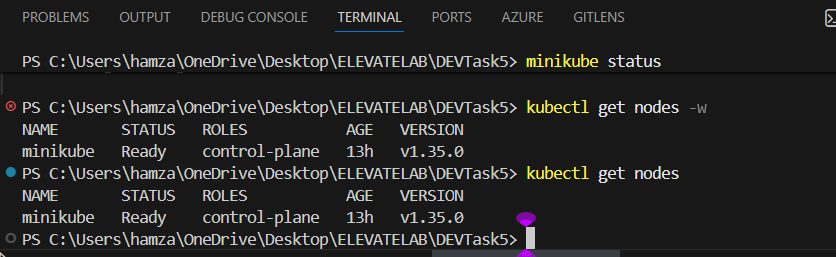
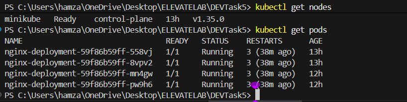
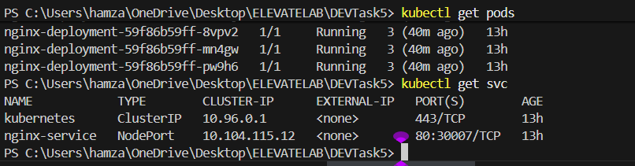
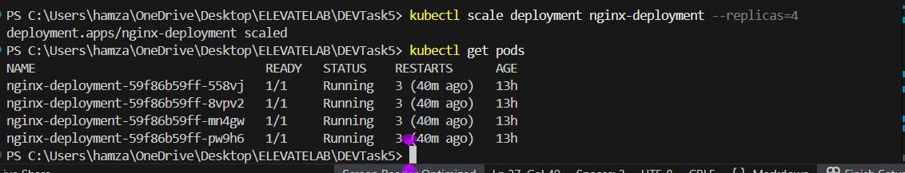
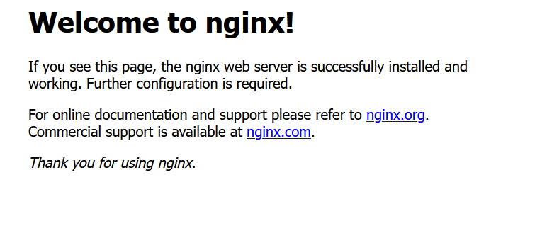

# Task 5: Build a Kubernetes Cluster with Minikube

## Objective
Deploy and manage applications in Kubernetes using Minikube.

## Tools Used
- Minikube
- kubectl
- Docker

## Steps Performed
1. Installed Minikube and started cluster.
2. Created nginx deployment using deployment.yaml.
3. Exposed application using service.yaml.
4. Verified pods using:
   kubectl get pods
5. Scaled deployment:
   kubectl scale deployment nginx-deployment --replicas=4
6. Used describe and logs for inspection.

## Screenshots
## 📸 Screenshots

### Cluster Status

### Running Pods

### Service Details

### Scaled Deployment (4 Replicas)

### Nginx Output in Browser
   this my  README.md   but not showing  github 

